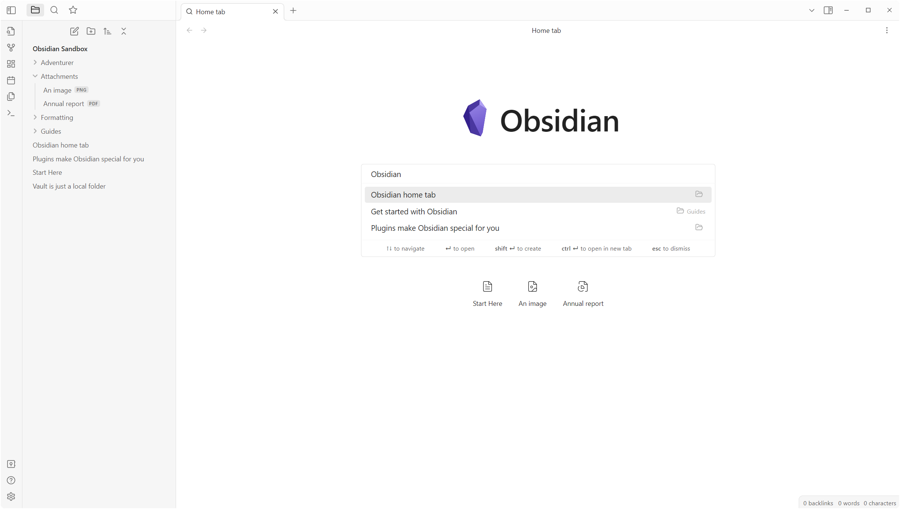
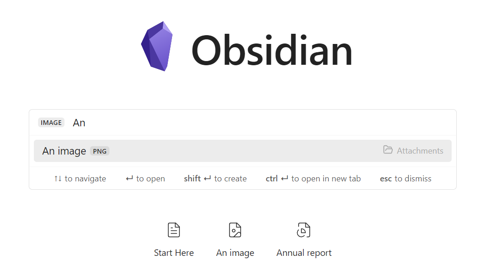
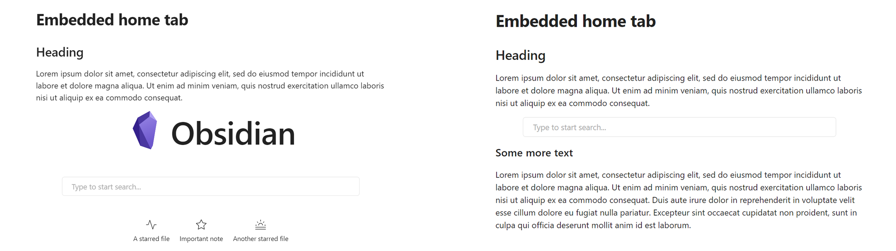
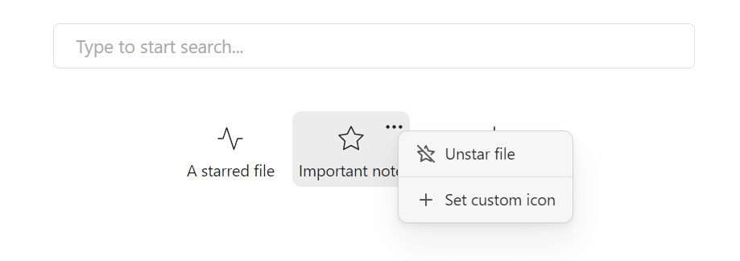
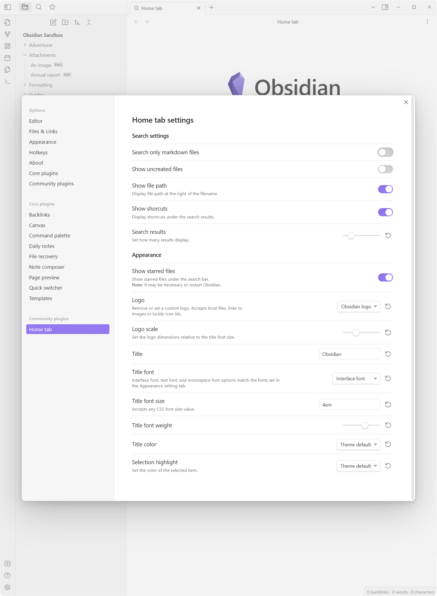

## 🚧 Not currently maintained
⚠️ Due to time constraints, I am unable to actively maintain or improve this plugin at the moment. However, your contributions are highly appreciated! Feel free to open pull requests or fork the project to continue its development.

---
# Obsidian Home tab
Obsidian Home tab is an [Obsidian](https://obsidian.md/) plugin that adds a browser-like home default new tab with a search bar and a grid of starred files.

You can search any local file in your vault, both markdown notes and attachments.



This plugin is not meant to be a replacement for the default Quick switcher or any alternative one like [Another quick switcher](https://github.com/tadashi-aikawa/obsidian-another-quick-switcher) (from which I took inspiration), but rather a faster way to open a note or a file after opening a new tab.

## How to use
By default, every new empty tab is automatically replaced with the Home tab view. You can disable this behavior in the settings and manually open a new Home tab through the command palette with the commands `Home tab: Open new Home tab` or `Home tab: Replace current tab`.

## Features
### Filter search by file type or extension
To easily find a file you can filter the search by using filters for the file type or the file extension.

You can activate a filter by writing the filter key (see table below) and pressing tab. To remove the filter press backspace.



#### Filters keys
The following filters are available:

| File type | File extension | 
| :-: | :-: | 
| `markdown` | `md`|
| `image` | `png`, `jpg`, `jpeg`, `svg`, `gif`, `bmp` | 
| `video` | `mp4`, `webm`, `ogv`, `mov`, `mkv` |
| `audio` | `mp3`, `wav`, `m4a`, `ogg`, `3gp`, `flac` |
| `pdf` | `pdf` |  
| `canvas` | `canvas` |


### Embedded search bar
You can embed the Home tab view in any note with options to show recent files, starred files, or only the search bar.

To embed the search bar to a note, you have to create a `search-bar` code block (see the following example).

To show only the search bar, without the title and the logo/icon, add (in a new line) `only search bar`.
To show the starred and recent files add, respectively, `show starred files` and `show recent files`.

For example, the following code block will render the search bar and the starred files.
````text
```search-bar
only search bar
show starred files
```
````




### Starred files
If enabled, starred files are automatically displayed under the search bar.

By hovering the top right corner, you can unstar a file or change the displayed icon.



## Settings



---
## Known issues
The plugin may not work with (or interfere with) other plugins that replace the new tabs with their custom view, such as the [Obsidian-Surfing](https://github.com/PKM-er/Obsidian-Surfing) plugin.

---
# How to install
The plugin is available directly from the [Obsidian plugin browser](https://obsidian.md/plugins?id=home-tab).
Alternatively, you can install with [BRAT](https://github.com/TfTHacker/obsidian42-brat) by using the following links: `https://github.com/olrenso/Obsidian-home-tab` or `olrenso/Obsidian-home-tab`.

